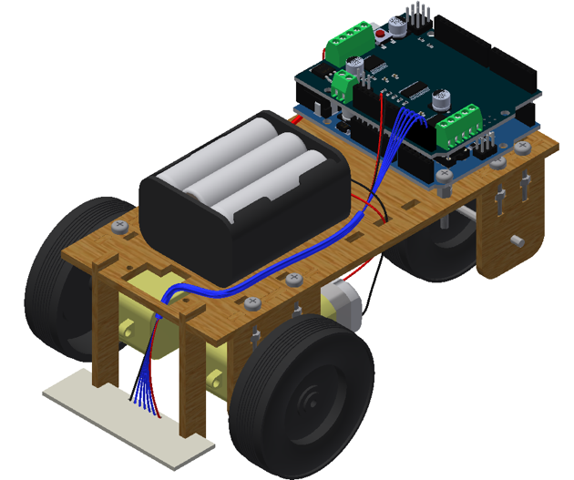

About
=====

A few years ago [EARS](https://twitter.com/surreyears?lang=en) were asked by the University of Surrey to create a project for an event called [Headstart](http://www.etrust.org.uk/headstart/courses). During this week long event a group of sixth form students who are considering studying engineering at university have around 5 hours of lab sessions to complete a project.

E.R.N.I.E (EARS Robotic Navigator and Intrepid Explorer) was the project I came up with for the electronic engineering project. ERNIE is a very low cost line following robot that can be assembled and programmed by students with very little previous knowledge in electronics or programming.

Over the past few years the project has evolved to become (almost) fully re-usable by only requiring zip ties, screws and electrical tape to assemble. The only part that cannot be done again is the soldering of the PCB, but the assembled PCB can of course be re-used.

Notes for schools and people making their own
=============================================
Assembly instructions for building an E.R.N.I.E can be found [here](doc/assembly instructions.pdf).
While these are mostly complete they assume you have been given a ready made kit and don't include preparation details.
Additional notes for schools can be found [here](SCHOOLS.md).

If you are an individual wanting to make an E.R.N.I.E for yourself please read through the [kit preparation](SCHOOLS.md#kit-preparation) section on the schools page for details on the extra steps you will need to take. For individuals I can also offer free PCBs since I have quite a lot left over. All I ask is you cover the postage costs (won't be much because it can be sent as a small letter). Just drop me an email at sebastian.goscik@live.co.uk

Code examples
=============
Code examples for E.R.N.I.E are kept in a separate repository that can be found [here]()

Files
=====
 * __/BoM.pdf__ - Bill of Materials, contains a complete list of parts needed and where to buy them
 * __/Chassis v2.1.dxf__ - Chassis design for a laser cutter
 * __/Chassis v2.1.razorlab.svg__ - Same as above but ready to be sent straight to [Razorlab](http://razorlab.co.uk/) using their P1 size
 * __/README.md__ - This is the file you are now reading
 * __/SCHOOLS.md__ - Information on using E.R.N.I.E in schools e.g. kit preparation details
 * __/doc/assembly instructions.pdf__ - Instructions on how to assemble E.R.N.I.E (including diagrams)
 * __/doc/worksheet.pdf__ - Basic arduino and line following tutorial
 * __/doc/Sensor board - XXX.pdf__ - Schematic and PCB files in viewable form
 * __/license/XXX__ - Details about how this project is licensed, including who to email when you make changes or a production run
 * __/PCB/XXX__ - [Cadsoft EAGLE](http://www.cadsoftusa.com/) source files for the sensor board
 * __/src/3d/XXX__ - Autodesk Inventor source files that this project was made from
 * __/src/doc/XXX__ - Microsoft Word source files for the assembly instructions and worksheet
 * __/src/PCB/XXX__ - Cadsoft EAGLE source file for a panellised version of the pcb and the one used in the pcb pdf
 * __/src/PCB/gerbers (elecrow).zip__ - The gerber files sent to [Elecrow](http://www.elecrow.com/) to produce the PCBs
 * __/src/BoM.xlsx - Microsoft Excel source for the bill of materials

To Do
=====
There are a few extra things I would like to add to this project in the future if time permits:
 * 3D printed shroud for the IR sensors to minimise cross talk
 * 3D printed servo -> HC-SR04 mount
 * Add soldering instructions
 * add software setup instructions

If you manage to implement any of the above or something I haven't even considered please let me know!

Credit
======
The very first version of the E.R.N.I.E chassis was created with the help of my good friend [Revanth Adiga](https://uk.linkedin.com/pub/revanth-adiga/a7/94a/929)

CAD models used:
 * [Arduino by Andrew Whitham](https://grabcad.com/library/arduino-uno-r3-1)
 * [Motor Shield by mandrillon](https://grabcad.com/library/adafruit-motor-shield-v2-1)
 * [Battery Holder by Georgina Koffler](https://grabcad.com/library/6-aa-battery-pack)
 * [AA Battery by Cody Thurston](https://grabcad.com/library/energizer-aa-battery)

License
=======
Copyright S.Goscik 2015

The schematic, PCB and chassis designs and their respective documentation are Open Hardware and are licensed under the CERN OHL v. 1.2.
You may redistribute and modify this work under the terms of the CERN OHL v.1.2. (http://ohwr.org/cernohl). This work is distributed WITHOUT ANY EXPRESS OR IMPLIED WARRANTY, INCLUDING OF MERCHANTABILITY, SATISFACTORY QUALITY AND FITNESS FOR A PARTICULAR PURPOSE. Please see the CERN OHL v.1.2 for applicable conditions

There are only a few simple requirement that you must do under this license:

 * If you make any changes to the project please share them freely, under the same license.
 * Please list your changes in [CHANGES.TXT](license/CHANGES.TXT).
 * Please notify the people listed in [CONTRIB.TXT](license/CONTRIB.TXT) of your changes.
 * If you know how to use git and feel your change improve the project (e.g. fixing my spelling/grammar or updating the worksheet) please fork this repository and make a pull request of your changes.
 * If you produce any E.R.N.I.E kits (chassis or PCBs) please notify the people listed in [PRODUCT.TXT](license/PRODUCT.TXT).

If any of your e-mails fail to go through you don't need to worry about it. The reason I ask for these things is so that the people who have contributed to the project can see how it progresses and that it remains free for everyone.
